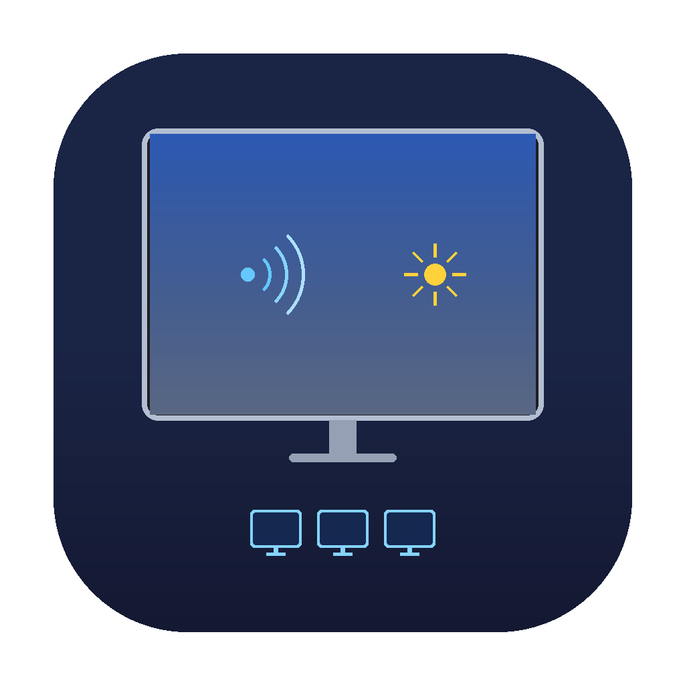

# Studio Display Control

A lightweight macOS menu bar utility that **simultaneously controls volume and brightness across all connected Apple Studio Displays** using your keyboard keys.



## The Problem

If you have multiple Apple Studio Displays connected to your Mac, macOS doesn't provide a way to:

- Adjust volume on all displays at once using keyboard keys when using a Multi-Output Audio Device
- Sync brightness across all displays with a single key press

You're stuck adjusting each display individually, or paying $39+ for third-party tools.

## The Solution

**Studio Display Control** intercepts your keyboard's media keys and applies changes to all connected Studio Displays simultaneously.

## Features

- **Synced Volume Control** — F10/F11/F12 keys adjust volume on all Studio Displays at once
- **Synced Brightness Control** — F1/F2 keys adjust brightness on all Studio Displays at once
- **Mute Toggle** — Mute/unmute all displays simultaneously
- **Menu Bar Sliders** — Manual adjustment via sliders in the menu bar dropdown
- **Hot-Plug Support** — Automatically detects newly connected displays (polls every 10s)
- **Lightweight** — Single-file Swift app, no dependencies, minimal resource usage
- **Menu Bar Only** — No Dock icon, runs quietly in the background

## Screenshots

When you click the 🖥️ icon in the menu bar:

```
Studio Display: Audio ×3  Display ×3
────────────────────────────────
🔊 Volume
  Volume: 50%
  [━━━━━━━━━━━━━━━━━━━━]
  Mute
────────────────────────────────
☀️ Brightness
  Brightness: 75%
  [━━━━━━━━━━━━━━━━━━━━]
────────────────────────────────
Refresh Devices
────────────────────────────────
Quit
```

## Requirements

- macOS 13.0 (Ventura) or later
- Apple Studio Display(s) connected via Thunderbolt/USB-C
- Xcode Command Line Tools (`xcode-select --install`)

## Installation

### Build from source

```bash
git clone https://github.com/YOUR_USERNAME/StudioDisplayControl.git
cd StudioDisplayControl
chmod +x build_app.sh
./build_app.sh
```

### Install

```bash
cp -r StudioDisplayControl.app /Applications/
```

### First launch

1. **Open the app** — Right-click `StudioDisplayControl.app` in Applications → Open → Open again (required for unsigned apps)
2. **Grant Accessibility permission** — System Settings → Privacy & Security → Accessibility → Add and enable Studio Display Control
3. **Relaunch the app** after granting permission

### Launch at login (optional)

System Settings → General → Login Items → Add `StudioDisplayControl`

## How It Works

- **Volume**: Uses CoreAudio APIs to directly control each Studio Display's audio device volume
- **Brightness**: Uses Apple's private `DisplayServices` framework to control display brightness
- **Key Interception**: Creates a CGEvent tap to intercept system-defined media key events (NX_SYSDEFINED) before macOS processes them

## Technical Details

The app is a single Swift file (~400 lines) with no external dependencies. It uses:

| Component | Framework | Purpose |
|-----------|-----------|---------|
| Audio control | CoreAudio | Get/set volume and mute state per audio device |
| Brightness control | DisplayServices (private) | Get/set brightness per display |
| Key interception | Carbon / Quartz Events | Intercept media keys via CGEvent tap |
| Menu bar UI | AppKit | NSStatusItem with sliders |
| Display detection | CoreGraphics | Enumerate displays, filter by Apple vendor ID |

## Known Limitations

- **Brightness control uses a private Apple framework** (`DisplayServices`). This could break in future macOS updates, though it has been stable for years.
- **No native macOS OSD** — The system volume/brightness overlay won't appear since the app intercepts the keys before macOS processes them.
- **Unsigned app** — You'll need to right-click → Open on first launch since the app isn't signed with an Apple Developer certificate.
- **No Widget support** — macOS widgets require WidgetKit which needs a full Xcode project with Widget Extension.

## Uninstall

1. Quit the app from the menu bar (click 🖥️ → Quit)
2. Delete from Applications: `rm -rf /Applications/StudioDisplayControl.app`
3. Remove from Login Items if added
4. Remove from Accessibility in Privacy & Security settings

## License

MIT License — see [LICENSE](LICENSE) for details.

## Contributing

Pull requests welcome! Some ideas:

- [ ] Native macOS OSD overlay when adjusting volume/brightness
- [ ] Individual per-display volume/brightness control
- [ ] Keyboard shortcut customization
- [ ] Support for non-Apple external displays (via DDC)
- [ ] Sparkle auto-updater
